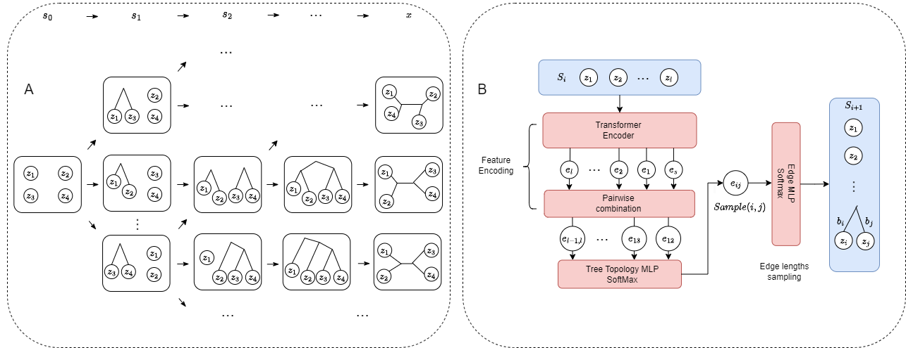
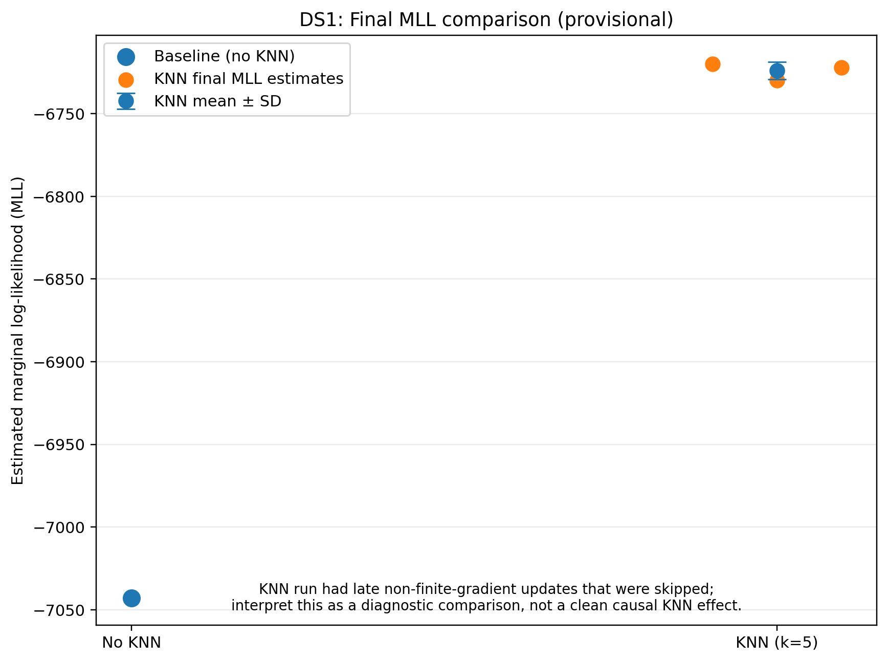
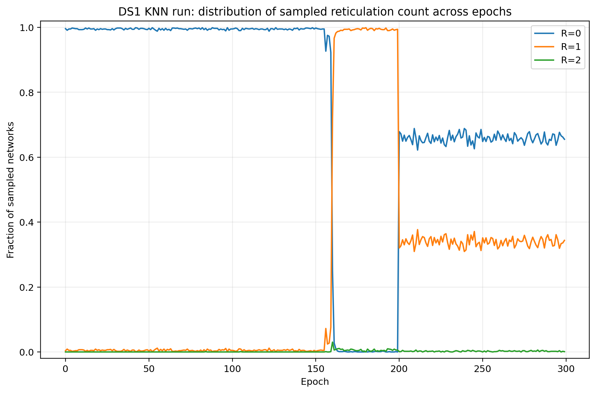
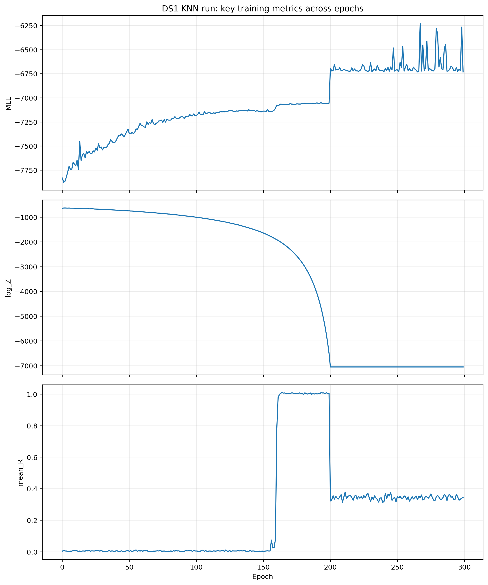

# PhyloGFN: Phylogenetic inference with generative flow networks
Official repository of [PhyloGFN: Phylogenetic inference with generative flow networks](https://openreview.net/forum?id=hB7SlfEmze) (ICLR 2024)

Mingyang Zhou, Zichao Yan, Elliot Layne, Esmeralda S. Whitammer, Dinghuai Zhang, Moksh Jain, Mathieu Blanchette, Yoshua Bengio



We design a GFlowNet based generative model for phylogenetic inference, achieving strong results in both Bayesian and parsimony-based phylogenetic inference.

## Citation
```bibtex
@inproceedings{
    zhou2024phylogfn,
    title={Phylo{GFN}: Phylogenetic inference with generative flow networks},
    author={Ming Yang Zhou and Zichao Yan and Elliot Layne and Esmeralda S. Whitammer and Dinghuai Zhang and Moksh Jain and Mathieu Blanchette and Yoshua Bengio},
    booktitle={The Twelfth International Conference on Learning Representations},
    year={2024},
    url={https://openreview.net/forum?id=hB7SlfEmze}
}
```


## Environment Setup

```
conda create -n phylogfn python=3.10
conda activate phylogfn
conda install pytorch torchvision torchaudio pytorch-cuda=11.8 -c pytorch -c nvidia
conda install anaconda::docopt
conda install etetoolkit::ete3
conda install matplotlib tqdm dill fvcore iopath docopt
```

## Usage
Our latest progress with continuous branch lengths modeling is implemented. To train a phyogfn model

```buildoutcfg
python train.py <cfg_path> <sequences_path> <output_path> [--nb_device=<device_num>] [--quiet] [--amp]
```
- Example sequences datasets DS1-DS8 are stored in the folder `dataset/benchmark_datasets`
- Example training `<cfg_path>` are stored in the folder `src/configs/benchmark/dna_cfgs`
    - Continuous branch lengths modeling configs are in the folder `continuous_branch_lengths_modeling`
    - Discrete branch lengths modeling configs are in the folder `discrete_branch_lengths`

PhyloGFN with continuous branch length modeling achieves SOTA MLL estimation performance.

|                | Training trajs |     DS1         |     DS2         |     DS3         |     DS4         |     DS5         |     DS6         |     DS7         |     DS8         |  cfg/weights       |
|----------------|----------------|-----------------|-----------------|-----------------|-----------------|-----------------|-----------------|-----------------|-----------------|----------------|
| PhyloGFN Full |    3.20E+07    | -7108.4 (0.04)  | -26367.7 (0.04) | -33735.1 (0.02) | -13329.9 (0.09) | -8214.4 (0.16)  | -6724.2 (0.10)  | -37331.9 (0.14) | -8650.5 (0.05)  |       -        |
| PhyloGFN 40%  |    1.28E+07    | -7108.4 (0.05) | -26367.7 (0.05) | -33735.2 (0.04) | -13330.1 (0.07) | -8214.5 (0.14)  | -6724.3 (0.10)  | -37332.1 (0.27) | -8650.4 (0.16)  |       -        |
| PhyloGFN 24%  |    7.68E+06    | -7108.4 (0.05) | -26367.7 (0.02) | -33735.1 (0.07) | -13330.0 (0.08) | -8214.5 (0.13)  | -6724.2 (0.21)  | -37332.2 (0.26) | -8650.4 (0.15)  | [googledrive](https://drive.google.com/drive/folders/1TbpnCUMvLdYxfr71nY_k5_BftPlaxKYW?usp=drive_link)|


For discrete branch lengths modeling, we suggest to use the config file with the following configurations:

|         |  DS1  |  DS2  |  DS3  |  DS4  |  DS5  |  DS6  |  DS7  |  DS8  |
|---------|-------|-------|-------|-------|-------|-------|-------|-------|
| Bin size| 0.001 | 0.004 | 0.004 | 0.002 | 0.002 | 0.001 | 0.001 | 0.001 |
| Bin num |   50  |   50  |   50  |  100  |  100  |  100  |  200  |  100  |

We will publish the optimized code for parsimony analysis in the near future. In the meantime, if you are interested, please refer to the [supplementary materials](https://openreview.net/attachment?id=hB7SlfEmze&name=supplementary_material) to run parsimony analysis.


## DS1 KNN Results

We evaluated the DS1 phylogenetic-network model with **k-nearest-neighbour (KNN) candidate filtering** using `k=5`.

The experiment used the same main DS1 network configuration as the previous network run, with KNN enabled while the other proposal components remained disabled.

- Dataset: **DS1**
- Epochs: **300**
- Steps per epoch: **200**
- KNN: **enabled**
- `k = 5`
- Final checkpoint: `checkpoint_000299.pt`
- Final checkpoint finite: **yes**

### Training diagnostics

The following figure summarizes the main training diagnostics across all 300 epochs.


The run completed all 300 epochs. During late training, some optimizer updates produced non-finite gradients. A numerical safety guard skipped these updates to prevent corruption of the model parameters.

Therefore, the current run is treated as a **completed KNN diagnostic experiment**, rather than a fully clean causal comparison with the no-KNN baseline.

### Final marginal log-likelihood

The three final MLL estimates were:

- `-6720.01`
- `-6729.83`
- `-6721.95`

Mean final MLL:

**-6723.93 ± 5.20**

The previous DS1 network run without KNN obtained approximately:

**-7043.06**



The raw numerical difference is approximately **+319.13 nats**.

This difference should **not yet be interpreted as a clean improvement caused by KNN**, because the KNN run experienced non-finite-gradient updates during late training.

### Reticulation-count behaviour

The sampled reticulation-count distribution across training is shown below.



At the final epoch, among 1024 sampled networks:

| Reticulation count | Samples | Fraction |
|---|---:|---:|
| `R=0` | 671 | 65.53% |
| `R=1` | 352 | 34.38% |
| `R=2` | 1 | 0.10% |

Final mean reticulation count:

**mean R = 0.346**

`R_MAX=2` is an experimental upper bound and should not be interpreted as a biological conclusion.

### Key training metrics



At the final epoch:

| Metric | Value |
|---|---:|
| MLL | `-6730.80` |
| log Z | `-7051.88` |
| Pearson r | `0.169` |
| mean R | `0.346` |

The relatively low final Pearson correlation indicates that convergence quality still requires investigation.

### KNN candidate-quality diagnostic

KNN candidate recall was evaluated before the full KNN training run.

| k | Recall@5 | Approx. candidate merge pairs | Approx. legal merge pairs |
|---:|---:|---:|---:|
| 5 | 0.960 | 52.0 | 144.3 |
| 10 | 1.000 | 94.0 | 144.0 |
| 20 | 1.000 | 138.0 | 141.7 |

`k=5` was selected because it retained high recall while substantially reducing the number of merge candidates scored by the pair-scoring network.

The current exact-KNN implementation still computes pairwise distances when constructing the candidate set, so this result should not be interpreted as an end-to-end `O(Nk)` implementation.

### Numerical-stability note

During late training, some updates produced non-finite gradients.

These optimizer updates were skipped by a numerical safety guard. The final checkpoint was checked and contains no NaN/Inf tensors.

The exact number of skipped optimizer updates was not stored in the training history. Consequently, these results are useful for diagnosing the KNN extension, but a cleaner validation experiment is still needed before making a definitive baseline-vs-KNN performance claim.

### Detailed result files

- [300-epoch summary](results/DS1_KNN_300ep/DS1_knn_300ep_results.txt)
- [Epoch-by-epoch results](results/DS1_KNN_300ep/DS1_knn_300ep_epochs.txt)
- [Final R distribution](results/DS1_KNN_300ep/DS1_KNN_R_distribution_last_epoch.txt)
- [Final key metrics](results/DS1_KNN_300ep/DS1_KNN_key_metrics_last_epoch.txt)


## TODO list
- [ ] mutigpu training 
- [ ] parsimony inference


