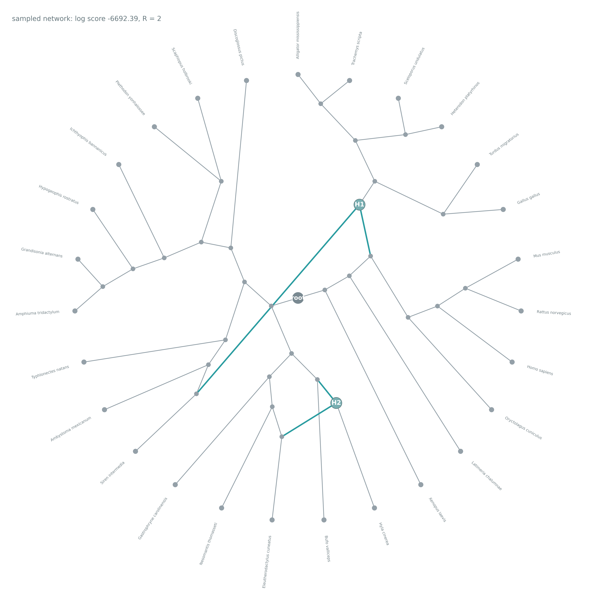

# DS1 — PhyloGFN-Net Results

## Sampled Level-1 Phylogenetic Network

**Figure:** A phylogenetic network sampled from the trained PhyloGFN-Net model for DS1 using the final checkpoint at epoch 299.

The dataset contains 27 taxa. This sampled network contains two reticulation events (`R = 2`), represented by the reticulation nodes `H1` and `H2`.

Gray edges represent the tree-like part of the topology, while the highlighted teal edges indicate reticulation connections. The root is shown near the center of the network.

The radial arrangement is used only for visualization and does not represent evolutionary time or biological distance.

This figure represents one sample from the learned distribution. It is not necessarily the highest-scoring or most frequently sampled network topology.

Branch lengths and reticulation inheritance probabilities (`theta`) are not displayed in this visualization.

### Source

- Dataset: DS1
- Model: PhyloGFN-Net
- Network class: Level-1 phylogenetic network
- Final checkpoint: epoch 299
- Maximum reticulations allowed: `R_MAX = 2`
