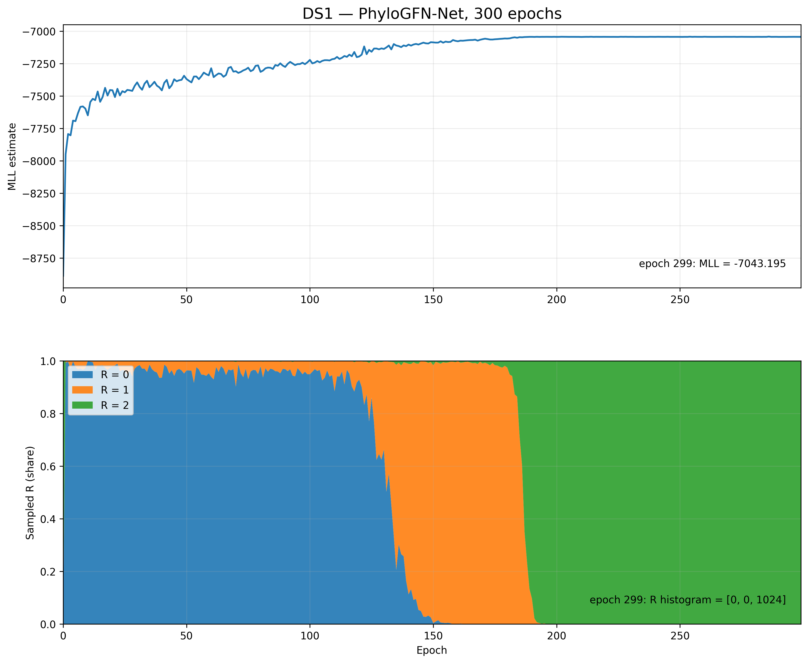

# DS1 300-epoch network result

## Annotated network figure

Below is one sampled level-1 phylogenetic network from the trained DS1 model (epoch 299 checkpoint).

## What this figure shows

- This is a sampled phylogenetic **network**, not a tree.
- The figure comes from the trained **PhyloGFN-Net** model on **DS1**.
- The network contains **2 reticulation nodes**: **H1** and **H2**.
- Gray edge labels show **branch lengths**.
- Reticulation edges also show **inheritance weight (theta)**.
- The root is shown at the center/top of the network layout.

## Files

- `network_radial_v3_annotated.png`  
  Annotated network figure with branch lengths and inheritance weights.

- `network_radial_v3_edges.txt`  
  Text table containing the numerical branch lengths and inheritance weights.

## Interpretation

This result shows that the trained model can generate a level-1 phylogenetic network and assign:
- branch lengths to edges,
- and inheritance probabilities to reticulation parents.

This figure is one sampled example from the checkpoint at epoch 299.

## Training diagnostics

The figure above shows the training diagnostics for the 300-epoch DS1 PhyloGFN-Net run.

The upper panel shows the MLL estimate across training epochs.

The lower panel shows the fraction of evaluation samples with 0, 1, or 2 reticulations (`R = 0`, `R = 1`, and `R = 2`).

During training, the sampled reticulation count changes substantially. Early evaluations are dominated by `R = 0`, an intermediate phase is dominated by `R = 1`, and the final evaluations are dominated by `R = 2`.

At epoch 299:
- MLL = -7043.195
- mean R = 2.00
- R histogram = [0, 0, 1024]

This diagnostic was generated directly from the completed 300-epoch training log; no retraining was performed.
