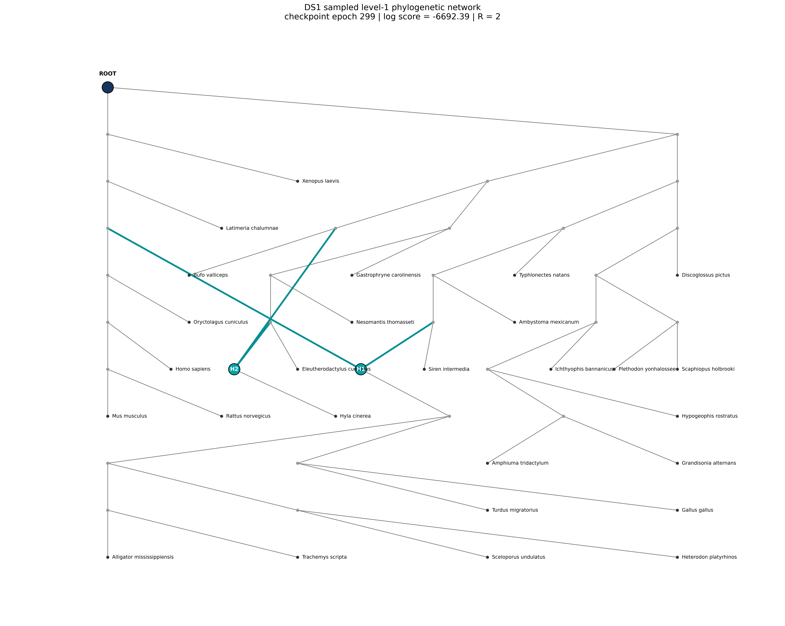

# DS1 — Phylogenetic Network

This folder contains the completed DS1 phylogenetic-network experiment without KNN candidate filtering.

## Experiment

- Dataset: DS1
- Model: PhyloGFN-Net
- Epochs: 300
- Steps per epoch: 200
- Maximum reticulations: `R_MAX = 2`
- Forward objective: Trajectory Balance (TB)
- Backward policy: uniform
- Reticulation prior: `EXP_R`
- KNN filtering: disabled

## Main result

The completed network run obtained a final marginal log-likelihood of approximately:

**MLL = -7043.06**

The final epoch reported approximately:

- MLL: `-7043.195`
- Pearson correlation: about `0.98`
- mean R: `2.00`
- R histogram: `[0, 0, 1024]`

For comparison, the DS1 phylogenetic-tree baseline is approximately:

**MLL = -7108.47**

The network model therefore produced a numerically higher MLL on this DS1 experiment.

This comparison is conditional on the current model, prior, likelihood, and estimator settings and should not be interpreted as biological proof of reticulation.

## Training diagnostics

The training trajectory shows how the estimated MLL and sampled reticulation counts changed over the 300 epochs.

Early evaluations contain many `R=0` samples, followed by an intermediate region with substantial `R=1` mass, while the final evaluations concentrate at `R=2`.

Because `R_MAX=2` is an imposed experimental upper bound, this final concentration should not be interpreted as evidence that the true biological history contains exactly two reticulations.

## Example sampled network

This is one network sampled from the final checkpoint.

- Gray edge labels show branch lengths.
- Reticulation edges include inheritance weights (`theta`).
- The radial layout is used only for visualization.

A second visualization is available here:

## Detailed files

### Metrics

- [Epoch-by-epoch training results](metrics/DS1_network_300ep_epochs.txt)
- [Full training log](metrics/DS1_network_300ep_full_log.txt)
- [Network topology](metrics/network_now_topology.txt)
- [Annotated edge table](metrics/network_radial_v3_edges.txt)

### Configuration

- [DS1 300-epoch configuration](configs/cfg_net_DS1_300ep.yaml)

## Interpretation

This experiment demonstrates that the extended model can generate rooted level-1 phylogenetic networks with:

- branch lengths,
- reticulation events,
- inheritance probabilities,
- and likelihood-based posterior scoring.

The result should be interpreted as a model-fitting result under the current experimental assumptions, not as a direct biological conclusion.
