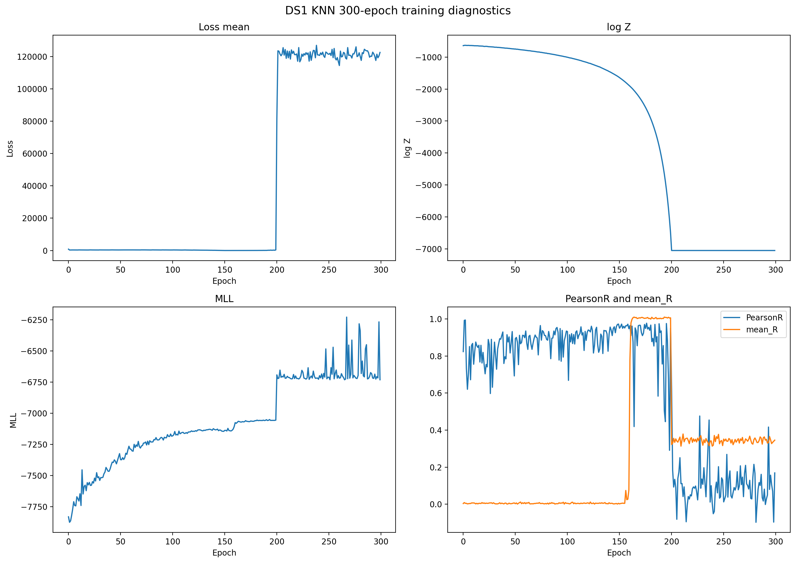

# DS1 — Phylogenetic Network with KNN

This folder contains the DS1 phylogenetic-network experiment with k-nearest-neighbour (KNN) candidate filtering enabled.

## Experiment

- Dataset: DS1
- Epochs: 300
- Steps per epoch: 200
- KNN enabled: yes
- `k = 5`
- Other proposal components: disabled for this comparison
- Final checkpoint: `checkpoint_000299.pt`

The purpose of this experiment was to compare the previous network model with the same main configuration while enabling KNN merge-candidate filtering.

## Final MLL

Three final MLL evaluations were:

- `-6720.01`
- `-6729.83`
- `-6721.95`

Mean:

**MLL = -6723.93 ± 5.20**

The previous DS1 network run without KNN obtained approximately:

**MLL = -7043.06**

The raw numerical difference is therefore about:

**+319.13 nats**

However, this difference should not yet be interpreted as a clean performance improvement caused by KNN because late-training numerical instability occurred in this run.

## Training diagnostics

The full 300-epoch run completed successfully and produced a finite final checkpoint.

During late training, some optimizer updates produced non-finite gradients. These updates were skipped by a numerical safety guard to prevent corruption of the model parameters.

Because of this intervention, the experiment is currently treated as a completed diagnostic KNN run rather than a definitive baseline-vs-KNN comparison.

## Final MLL comparison

This figure compares the previous network result with the three final KNN MLL estimates.

## Reticulation-count behaviour

At the final epoch, among 1024 sampled networks:

| R | Samples | Fraction |
|---|---:|---:|
| 0 | 671 | 65.53% |
| 1 | 352 | 34.38% |
| 2 | 1 | 0.10% |

Final mean reticulation count:

**mean R = 0.346**

This differs substantially from the previous no-KNN network run, where the final evaluation was concentrated at `R=2`.

## Key training metrics

At the final epoch:

- MLL: `-6730.80`
- log Z: `-7051.88`
- Pearson r: `0.169`
- mean R: `0.346`

The relatively low final Pearson correlation indicates that convergence quality requires further investigation.

## KNN candidate diagnostic

Before the full KNN run, candidate quality was evaluated using a successful DS1 checkpoint.

| k | Recall@5 | Candidate merge pairs | Legal merge pairs |
|---:|---:|---:|---:|
| 5 | 0.960 | ~52.0 | ~144.3 |
| 10 | 1.000 | ~94.0 | ~144.0 |
| 20 | 1.000 | ~138.0 | ~141.7 |

`k=5` was selected because it retained high recall while substantially reducing the number of merge pairs passed to the pair-scoring network.

The current exact-KNN implementation still computes pairwise distances during candidate construction, so the complete pipeline is not yet an end-to-end `O(Nk)` implementation.

## Numerical-stability note

Late in training, some gradients became NaN/Inf.

A safety guard skipped those optimizer updates.

The final checkpoint was checked and contains no non-finite tensors.

The exact number of skipped updates was not recorded in `history.pkl`, so this run should currently be considered diagnostic/provisional.

## Detailed files

### Metrics

- [300-epoch summary](metrics/DS1_knn_300ep_results.txt)
- [Epoch-by-epoch results](metrics/DS1_knn_300ep_epochs.txt)
- [Final R distribution](metrics/DS1_KNN_R_distribution_last_epoch.txt)
- [Final key metrics](metrics/DS1_KNN_key_metrics_last_epoch.txt)

### Configuration

- [KNN-only DS1 configuration](configs/ds1_knn_only_300ep.yaml)
